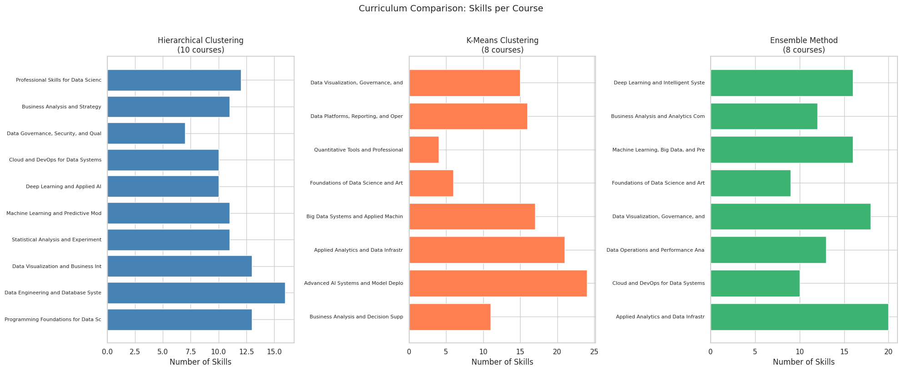
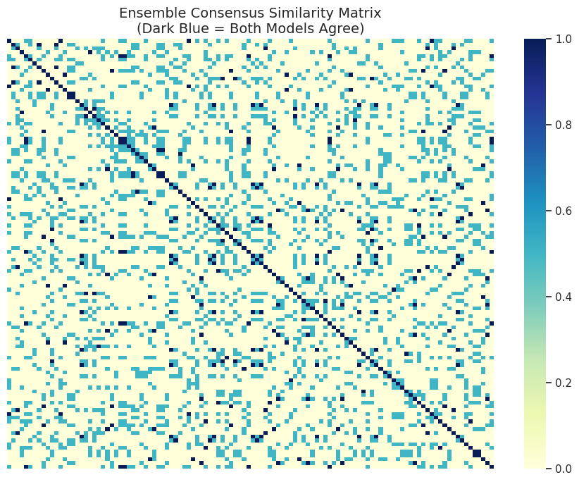

# Indeed Skill Clustering Curriculum Design

Web-scraping, skill-extraction, clustering, and curriculum design workflow built from Indeed job postings.

## Preview

<table>
  <tr>
    <td width="50%">
      
    </td>
    <td width="50%">
      
    </td>
  </tr>
</table>

## Project summary

This project turns web-scraped Indeed job postings into a skill-based curriculum design exercise. The workflow includes scraping, output cleanup, description enrichment, skill extraction, n-gram analysis, clustering, and final curriculum synthesis.

## Problem

The project asks how job-posting skills can be grouped into coherent curriculum modules that reflect real market demand.

## Data

- Indeed job postings collected through a custom scraping workflow
- enriched CSV output used for downstream analysis
- job titles, descriptions, salaries, companies, locations, and extracted skills

## Techniques

- web scraping workflow execution and monitoring
- data cleaning and enrichment of missing descriptions
- NLP-style skill extraction
- n-gram analysis
- feature engineering from skill text
- hierarchical clustering
- k-means clustering
- ensemble comparison of clustering-based curriculum modules
- Gemini-assisted interpretation and validation of curriculum structure

## Key outputs

- cleaned job-posting dataset
- missing-description recovery workflow
- skill co-occurrence analysis
- clustering comparison across multiple curriculum designs
- final curriculum module recommendations
- interpretation and validation of the resulting curriculum structure

## Repository structure

| File | Role |
| --- | --- |
| `xu_1007901512_assignment3-1.ipynb` | Main clustering and curriculum notebook |
| `xu_1007901512_webscraping-1.ipynb` | Web scraping workflow notebook |
| `xu_1007901512_assignment3-1.pdf` | Exported report version of the assignment |
| `webscraping_results_assignment3-1.csv` | Scraped and enriched job-posting output |
| `preview_curriculum_comparison.png` | Skills-per-course comparison across methods |
| `preview_skill_tsne.png` | t-SNE clustering visualization of skills |
| `preview_skill_heatmap.png` | Skill co-occurrence heatmap |

## Notes

The two notebooks belong together because one produces the data and the other turns that data into a curriculum design model. Keeping them in one repository makes the project story much clearer.
