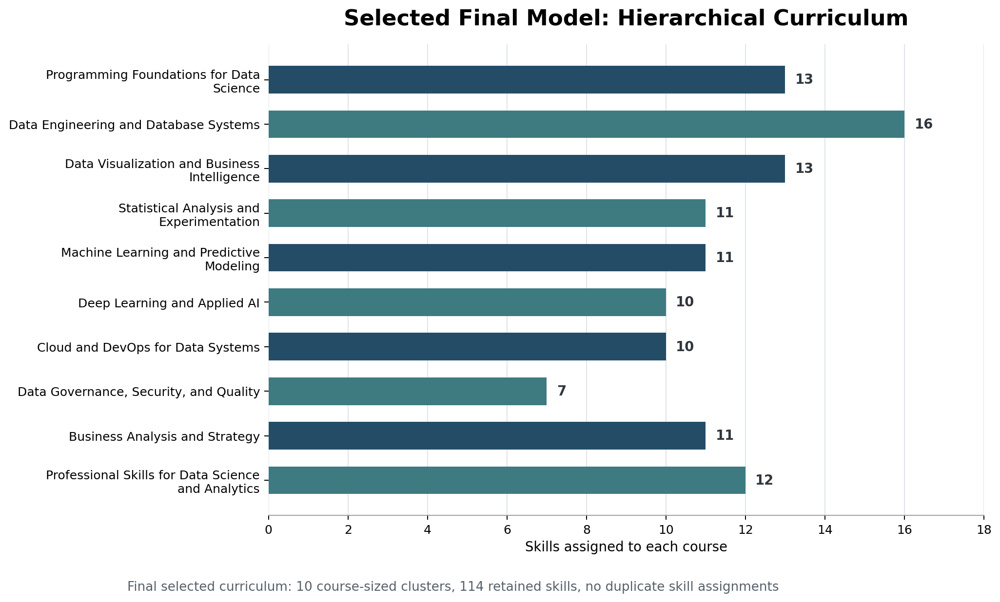

# Indeed Skill Clustering Curriculum Design

Web-scraping, skill-extraction, clustering, and curriculum design workflow built from Indeed job postings.

## Preview

## Project summary

This project turns web-scraped Indeed job postings into a skill-based curriculum design exercise. The workflow includes scraping, output cleanup, description enrichment, skill extraction, n-gram analysis, clustering, and final curriculum synthesis.

## Problem

This project develops a data-driven curriculum design for a proposed "Master of Business and Management in Data Science and Artificial Intelligence" program at the University of Toronto.

> The curriculum should cover technical, business, and soft skills needed for careers such as data scientist, analytics manager, data analyst, business analyst, and AI system designer. The project requires extracting in-demand skills from Indeed job postings, applying NLP or N-gram methods to convert posting text into skill features, and using clustering algorithms to group skills into 8-12 course-sized modules. Hierarchical clustering is required, and a second clustering method such as k-means or DBSCAN must also be used for comparison.

## Data

- Indeed job postings collected through a custom scraping workflow
- enriched CSV output used for downstream analysis
- job titles, descriptions, salaries, companies, locations, and extracted skills

## Techniques

- web scraping workflow execution and monitoring
- data cleaning and enrichment of missing descriptions
- NLP-style skill extraction
- n-gram analysis
- feature engineering from skill text
- hierarchical clustering
- k-means clustering
- ensemble comparison of clustering-based curriculum modules
- Gemini-assisted interpretation and validation of curriculum structure

## Achievements

- collected 1,015 self-scraped Indeed postings across Canada and the United States
- cleaned and enriched job-posting fields including title, company, location, salary, description, and posting link
- built a skill vocabulary from 55 manually seeded skills and 60 Gemini-expanded skills, then retained 114 skills after N-gram extraction
- generated six visual analyses covering in-demand skills, co-occurrence, seniority differences, hiring companies, job titles, and skill categories
- engineered 12 skill-level features covering demand intensity, salary signal, seniority, geography, company diversity, and Python/SQL co-occurrence
- implemented hierarchical clustering from a cosine-distance matrix and k-means clustering from engineered skill features
- compared hierarchical, k-means, and ensemble curriculum structures
- selected the hierarchical-clustering curriculum as the final model because it produced the clearest 10-course pathway, with 114 skills assigned once across course-sized clusters
- validated the final curriculum against an external industry report and Gemini-assisted curriculum interpretation

## Repository structure

| File | Role |
| --- | --- |
| `xu_1007901512_assignment3-1.ipynb` | Main clustering and curriculum notebook |
| `xu_1007901512_webscraping-1.ipynb` | Web scraping workflow notebook |
| `xu_1007901512_assignment3-1.pdf` | Exported report version of the assignment |
| `webscraping_results_assignment3-1.csv` | Scraped and enriched job-posting output |
| `preview_final_hierarchical_curriculum.png` | Final selected hierarchical curriculum preview |
| `preview_skill_tsne.png` | t-SNE clustering visualization of skills |
| `preview_skill_heatmap.png` | Skill co-occurrence heatmap |

## Skills practiced

This project practices web scraping, unstructured text cleaning, skill extraction, N-gram matching, feature engineering, unsupervised learning, clustering evaluation, curriculum design from labor-market evidence, and LLM-assisted interpretation with human validation.
